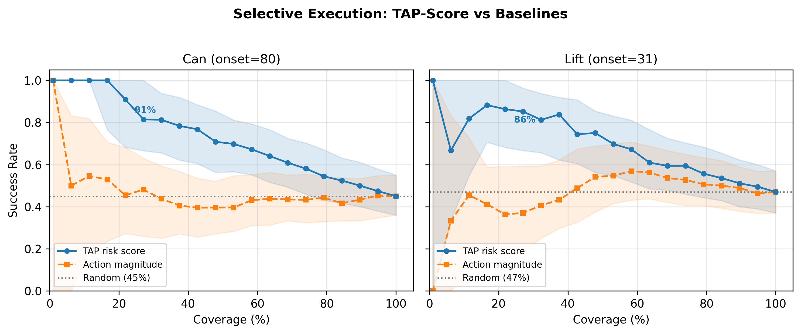

# TAP-Score: Method and Results

## 1. Problem Setup

Diffusion Policy (DP) achieves state-of-the-art performance on visuomotor manipulation benchmarks, but deploys as a black box: it produces multi-step action chunks with no indication of whether those actions will succeed. When observation quality degrades---through occlusion, sensor dropout, or distribution shift---the policy silently generates plausible-looking but incorrect actions that lead to task failure.

We present TAP-Score as a runtime risk monitor for Diffusion Policy that predicts whether a proposed action is likely to cause near-term failure, enabling selective execution on real rollout data. Given a (observation, proposed action) pair at each decision step, the model estimates the probability of failure within a future horizon. A reliable predictor enables **selective execution**: abstain from acting when the predicted risk is high, executing only when the system is confident, thereby trading coverage for reliability.

### Evaluation Setting

We evaluate on three robomimic manipulation tasks with pretrained DP checkpoints:

| Task | Obs Dim | Action Dim | Clean SR | Stress Regime | Stress SR |
|------|---------|-----------|----------|---------------|-----------|
| **Can** | 23 (lowdim) | 7 | 90% | zero_object onset=80 | 45% |
| **Lift** | 19 (lowdim) | 7 | 100% | zero_object onset=31 | 47% |
| **Square** | 23 (lowdim) | 7 | 74% | zero_object onset=80 | 18% |

Each stress regime zeroes all object-state fields at a specified onset step, simulating sudden occlusion mid-execution. Onset steps are chosen near the phase transition where success drops to roughly 50%, providing a balanced mix for detection evaluation.


## 2. Approach: Risk TAP-Score

### 2.1 Motivation: Why Not Reranking?

Before building a detector, we tested whether best-of-K reranking could rescue policy performance under occlusion. Oracle selection (choosing the candidate maximizing ground-truth return) across four configurations on Can (K=4 single/multi-decision, K=8 anticipatory) yielded a maximum gain of +1 episode out of 20 in every case (+5 percentage points).

**Root cause: candidate distribution collapse.** When key observation signals are missing, all K candidates are generated from the same degraded observation and propose similarly misguided actions. Sampling diversity cannot compensate for missing information. This structural limitation motivates using TAP-Score as a failure **detector** rather than a reranker.

### 2.2 Contrastive Phase (Push-T Prototype)

Our initial approach trained a contrastive scorer on Push-T using InfoNCE: given an observation, score the expert action against M negative action chunks, with higher log-margin indicating more expert-like behavior. This achieved AUROC 0.994 for detecting held-out failure types (scaling, bias, stuck, delayed), with 97.5% TPR at 1% FPR and stable performance across M (7--31 negatives).

However, when transferred to robomimic manipulation tasks, the contrastive approach peaked at AUROC 0.738. Under occlusion, the policy generates actions with correct magnitude and timing but targeting the wrong spatial location---structurally plausible actions that a contrastive scorer cannot distinguish from expert actions without object context.

### 2.3 Risk Predictor

We replaced the contrastive scorer with a supervised binary risk predictor trained on real DP rollout data.

**Architecture.** `RiskTAPScore` consists of an observation encoder (MLP) and action encoder (MLP) whose outputs are concatenated and fed through a sigmoid head. The model predicts:

$$P(\text{fail within } H \mid \text{obs}, \text{action})$$

where H = 64 environment steps (8 action chunks). The TAP safety score used for detection is `1 - risk_prob` (higher = safer).

**Training data.** For each task, we collect real DP rollouts under diverse perturbation regimes:

| Task | Episodes | Regimes | Fail Rate |
|------|----------|---------|-----------|
| Can | 500 | clean, zero80, zero80_jitter, dropout80_p02, dropout80_p04 | 43% |
| Lift | 250 | clean, zero31, dropout80, zero_jitter, dropout_p04 | 16% |
| Square | 250 | clean, zero80, dropout80, dropout_p02, dropout_p04 | 11% |

No synthetic data is used at any stage---all actions and outcomes come from real policy rollouts.

**Labeling.** We use two labeling modes depending on the task's failure dynamics:

- **Onset-window** (Can): label = 1 if the step falls within [onset, onset + H] AND the episode failed. Best for tasks with sustained failure signal after perturbation onset.
- **Episode-window** (Lift): label = episode outcome for steps within [onset, onset + W], W = 128, with balanced 50/50 sampling. Best for tasks with delayed or sparse failure signals.

**Training details.** Adam optimizer, lr = 1e-3, batch size 64, 30 epochs with early stopping on validation AUROC.


## 3. Results

### 3.1 Episode-Level Detection

| Task | AUROC | AUPRC | 95% CI | Mag Baseline | Aggregation | Val AUROC |
|------|-------|-------|--------|-------------|-------------|-----------|
| **Can** (n=100) | **0.856** | 0.881 | [0.779, 0.915] | 0.537 | mean | 0.973 |
| **Lift** (n=100) | **0.811** | 0.821 | [0.718, 0.892] | 0.551 | mean | 0.954 |
| Square (n=50) | 0.523 | --- | --- | 0.501 | min | 0.887 |

Both Can and Lift achieve episode-level AUROCs substantially above chance, with 95% confidence intervals excluding 0.5, and both outperform the action-magnitude baseline. Mean aggregation across per-step safety scores is the most effective episode-level statistic.

Square is a negative result. Although the model achieves strong step-level validation AUROC (0.887), this does not transfer to episode-level detection (0.523). We attribute this gap to low failure density in training data (11%), delayed and diffuse failure dynamics, and a mismatch between Square's failure structure and the onset-window labeling used in training.

### 3.2 Selective Execution (Centerpiece Result)

The practical value of TAP-Score is demonstrated through selective execution: rank episodes by safety score, execute only the top fraction, and measure success rate on the executed subset.

**Can (zero_object, onset=80):**

| Coverage | N Kept | TAP Success | Mag Baseline | Random Baseline |
|----------|--------|------------|-------------|-----------------|
| 10% | 10 | **100.0%** (10/10) | 50.0% (5/10) | 45.0% |
| 20% | 20 | **95.0%** (19/20) | 50.0% (10/20) | 45.0% |
| 30% | 30 | **80.0%** (24/30) | 43.3% (13/30) | 45.0% |
| 50% | 50 | **70.0%** (35/50) | 40.0% (20/50) | 45.0% |
| 100% | 100 | 45.0% (45/100) | 45.0% (45/100) | 45.0% |

AUC-SE: TAP = 0.717, Magnitude = 0.456, Random = 0.450.

**Lift (zero_object, onset=31):**

| Coverage | N Kept | TAP Success | Mag Baseline | Random Baseline |
|----------|--------|------------|-------------|-----------------|
| 10% | 10 | **80.0%** (8/10) | 40.0% (4/10) | 47.0% |
| 20% | 20 | **90.0%** (18/20) | 40.0% (8/20) | 47.0% |
| 30% | 30 | **83.3%** (25/30) | 40.0% (12/30) | 47.0% |
| 50% | 50 | **72.0%** (36/50) | 54.0% (27/50) | 47.0% |
| 100% | 100 | 47.0% (47/100) | 47.0% (47/100) | 47.0% |

AUC-SE: TAP = 0.689, Magnitude = 0.455, Random = 0.470.

Key observations:

1. **TAP doubles reliability at low coverage.** At 20% coverage, Can success jumps from 45% to 95% (+50pp) and Lift from 47% to 90% (+43pp). A system that abstains 80% of the time and only acts when confident achieves near-perfect reliability.

2. **Action magnitude is a weak baseline.** On both tasks, magnitude provides essentially no signal (Can AUC-SE 0.456 vs 0.450 random; Lift AUC-SE 0.455 vs 0.470 random). Under occlusion, failed and successful episodes have similar action magnitude profiles because the policy generates structurally plausible motions regardless of outcome.

3. **TAP's advantage grows at low coverage.** The gap between TAP and baselines widens as coverage decreases. TAP concentrates successes at the top of the ranking while baselines provide near-random ordering.


*Figure 1: Success rate vs. coverage for selective execution on Can (left) and Lift (right). TAP risk score (blue) substantially outperforms action magnitude (orange) and random (gray) baselines. Shaded bands show bootstrap 95% CIs.*

### 3.3 Lead Time

TAP-Score often flags failure shortly after perturbation onset, leaving substantial time before episode termination:

| Task | Median Lead Time | Mean | Total Episode Length |
|------|-----------------|------|---------------------|
| Can | 320 steps | 319 steps | 400 steps |
| Lift | 360 steps | 361 steps | 400 steps |

All 55 Can failures and all 53 Lift failures are detected (100% detection rate).

Detection occurs shortly after perturbation onset (Can onset=80, median detection at step 80; Lift onset=31, detection at step 40), providing substantial advance warning before the episode terminates.


## 4. Discussion

### What Works

Risk TAP-Score works best when failures produce a learnable and sufficiently dense near-term signal in real rollout data. On Can and Lift, supervised risk prediction on real policy rollouts outperforms contrastive expert-likeness scoring and enables useful selective execution. On Square, the failure signal is weaker and more delayed, revealing an important limitation of the current labeling and aggregation setup.

- **Supervised risk prediction on real rollout data** outperforms contrastive scoring for detecting failures under partial observability. The risk model learns the relationship between degraded observations and failure outcomes directly, rather than relying on expert-likeness as a proxy.
- **Mean aggregation** across per-step scores is the most robust detection statistic. Minimum scores are dominated by noise (all episodes have at least one low-confidence step), while mean captures that failed episodes spend more time at high risk.
- **Diverse perturbation regimes** in training data are critical. Models trained on a single regime overfit to that regime's signature. Including jittered onsets and multiple perturbation types produces robust detectors.

### Limitations

- **Low failure rate hurts.** Square's near-random detection (0.523) despite good validation AUROC (0.887) demonstrates that sufficient failure density in training data is necessary for episode-level discrimination. Can (43% failure rate) works well; Lift (16%) is marginal; Square (11%) fails.
- **Val-to-test gap.** Validation AUROC (on held-out steps from the same rollouts) substantially overestimates episode-level detection AUROC. Step-level classification is much easier than episode-level ranking because within-episode steps are correlated.
- **Coverage is limited to n=100.** Bootstrap CIs are reasonably tight but would benefit from larger evaluation sets.

### Comparison to Push-T Prototype

| Aspect | Push-T (Contrastive) | Robomimic (Risk) |
|--------|---------------------|------------------|
| AUROC | 0.994 | 0.856 (Can), 0.811 (Lift) |
| Failure type | Structural (wrong scale, stuck) | Spatial (wrong target location) |
| Training data | Expert demonstrations only | Real DP rollouts (500 episodes) |
| Obs type | Image (96x96) | Low-dim state |

Push-T failures produce structurally incompatible actions that are trivial to detect. Robomimic failures under occlusion produce spatially-incorrect but structurally-plausible actions, making detection fundamentally harder.


## 5. Reproduction

All results can be reproduced from the evaluation JSONs without GPU access:

```bash
# Selective execution analysis (generates Figure 1)
python scripts/analyze_selective_execution.py \
    --can eval_results/risk_detection_can_zero80_onset_n100.json \
    --lift eval_results/risk_detection_lift_zero31_epwin_n100.json \
    --output_dir artifacts/

# Full risk model pipeline (requires GPU + robosuite)
# 1. Collect rollouts
python scripts/collect_risk_rollouts.py \
    --dp_checkpoint data/robomimic/checkpoints/can_ph_diffusion_policy_cnn.ckpt \
    --task can --n_episodes 200 --output_dir data/risk_rollouts/can/ \
    --regimes clean zero80 freeze80 dropout80

# 2. Train risk model
python train_risk_tap.py \
    --rollout_dir data/risk_rollouts/can/ \
    --task can --epochs 30 --batch_size 64 \
    --fail_horizon 64 --hard_mining_epoch 10

# 3. Evaluate (writes both CSV and JSON)
python scripts/eval_tap_detection.py \
    --dp_checkpoint data/robomimic/checkpoints/can_ph_diffusion_policy_cnn.ckpt \
    --tap_checkpoint checkpoints_contrastive/robomimic_can_lowdim/risk_tap_best.pt \
    --risk_model --n_episodes 100 --device cuda \
    --output eval_results/risk_detection_can_zero80_onset_n100.csv
```
