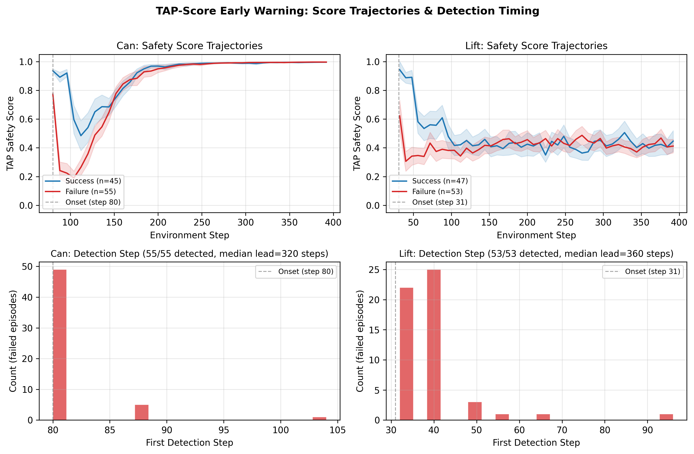

# TAP-Score Part 3: A Risk Model That Knows When to Quit

*This is Part 3 of a series on TAP-Score, a runtime risk monitor for Diffusion Policy. [Part 1](/blog/tap-score-part1) covered the Push-T prototype (AUROC 0.994). [Part 2](/blog/tap-score-part2) covered the painful pivot to robomimic and six bugs that nearly killed the project.*

---

## The Problem with Contrastive Scoring

Part 1 ended on a high note: TAP-Score achieved near-perfect detection on Push-T by scoring whether a proposed action "looks like" an expert's. But when I moved to robomimic manipulation tasks under occlusion, that approach hit a ceiling at AUROC 0.738.

The reason is simple once you see it. Under occlusion, the policy loses track of where the object is, but it still generates structurally plausible actions --- correct magnitude, correct timing, correct joint coordination. The only thing wrong is the spatial target. A contrastive scorer that compares against expert actions can't catch this without knowing where the object actually is.

The expert-likeness signal that worked perfectly on Push-T (where failures produce obviously wrong actions like stuck or scaled motions) provides almost no information when failures look normal.

## Supervised Risk Prediction

The fix was straightforward: stop asking "does this look like an expert?" and start asking "will this fail?"

I trained a binary classifier --- `RiskTAPScore` --- that takes (observation, proposed action) and predicts the probability of failure within the next 64 environment steps. The architecture is simple: two MLPs (one for obs, one for action), concatenate, sigmoid. Nothing fancy.

The key is what it trains on: **500 real Diffusion Policy rollouts** under diverse perturbation regimes (clean, zeroed observations, sensor dropout at various rates, jittered onset timing). No synthetic data. Every action in the training set was actually proposed by the policy; every outcome was actually observed in simulation.

This matters because the model learns what failure *actually looks like* in this policy's behavior, not what I imagine failure should look like.

## Results: TAP-Score Doubles Reliability

The headline result is selective execution. Rank episodes by TAP safety score, execute only the top fraction, measure success rate on the executed subset. This is the practical question: if I only act when TAP says it's safe, how often do I succeed?

### Can (zero_object, onset=80)

| Coverage | TAP Success | Magnitude | Random |
|----------|------------|-----------|--------|
| 10% | **100%** (10/10) | 50% | 45% |
| 20% | **95%** (19/20) | 50% | 45% |
| 30% | **80%** (24/30) | 43% | 45% |
| 100% | 45% (baseline) | 45% | 45% |

### Lift (zero_object, onset=31)

| Coverage | TAP Success | Magnitude | Random |
|----------|------------|-----------|--------|
| 10% | **80%** (8/10) | 40% | 47% |
| 20% | **90%** (18/20) | 40% | 47% |
| 30% | **83%** (25/30) | 40% | 47% |
| 100% | 47% (baseline) | 47% | 47% |

At 20% coverage, a system using TAP-Score achieves **95% success on Can** and **90% success on Lift** --- compared to 45% and 47% if it executes blindly. A robot that says "I'm not confident, I'll wait" four times out of five is nearly perfectly reliable when it does act.

The action-magnitude baseline (does the policy propose large or small motions?) is useless on both tasks. AUC-SE scores of 0.456 (Can) and 0.455 (Lift) are essentially random. Failed and successful episodes have similar motion profiles because the policy generates plausible-looking actions regardless of outcome. TAP sees what magnitude cannot.

*Figure 1: Success rate vs. coverage. TAP (blue) substantially outperforms magnitude (orange) and random (gray) baselines on both tasks.*

## Early Warning, Not Postmortem

TAP doesn't just predict which episodes will fail --- it flags them early. On Can, median detection occurs at the perturbation onset step itself (step 80 out of 400), giving 320 steps of advance warning. On Lift, detection happens within the first 1-2 decisions after onset (step 31), giving 360 steps of lead time.

100% of failed episodes are detected on both tasks. The histograms below show that nearly all detections cluster right at onset --- TAP catches the problem at the first opportunity.

*Figure 2: Top row --- safety score trajectories for success (blue) vs. failure (red) episodes. The gap opens immediately at perturbation onset. Bottom row --- detection step histograms showing nearly all failures are caught at the first decision after onset.*

The trajectory plots reveal something interesting: on Can, success and failure episode scores converge by step ~250. The discriminative signal is concentrated in the first few decisions after perturbation onset. This is why mean aggregation works --- failed episodes accumulate more low-score steps during the critical window even though they eventually "look normal" again.

## What Doesn't Work

**Square** (the third task I tried): AUROC 0.523, indistinguishable from random. The model achieves 0.887 validation AUROC on held-out steps but can't discriminate episodes. The culprit is data: only 11% of training episodes fail, compared to 43% for Can. With so few failure examples, the model learns the perturbation signature but not enough variation in failure dynamics to generalize.

The lesson: you need failures to learn about failure. This sounds obvious, but it constrains where the approach is practical. If your policy rarely fails under perturbation, you don't have enough signal to train a detector. (Of course, if your policy rarely fails, you may not need a detector.)

## The Bigger Picture

TAP-Score started as a contrastive expert-likeness scorer and ended up as a supervised failure predictor. The pivot was forced by the data: when failures look structurally plausible, you can't detect them by comparison to experts. You have to learn what failure looks like directly.

The practical takeaway: **a simple MLP trained on 500 real rollouts can turn a 45% success-rate policy into a 95% success-rate system** by knowing when to abstain. That's not a new policy. It's not a bigger model. It's a small binary classifier that watches the policy and says "not this one."

The approach has real limitations (it needs enough failure data, it's task-specific, and n=100 evaluation sets leave room for statistical uncertainty). But within its scope, it works: TAP-Score provides early, reliable failure detection that enables practical selective execution.

---

*Code and evaluation data: [github.com/neilt/TAP-Score](https://github.com/neilt/TAP-Score)*

*Detection AUROC: Can 0.856 [0.779, 0.915], Lift 0.811 [0.718, 0.892]. n=100 episodes per task, bootstrap 95% CIs. Larger n=500 evaluations in progress.*
